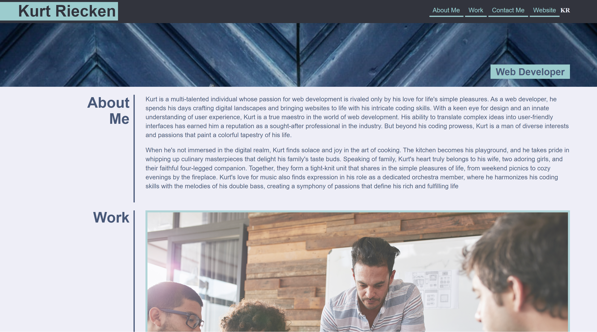

# Web Developer Portfolio

## Description

This is an online portfolio to display my most recent and extensive web development projects. It is a lightweight site meant to be a springboard to learn more about me as a developer and person. You will find links to my github and other various socials as well as information on how to get in touch with me. The site is designed to be user-friendly in navigation, contrast of color, and clarity of information.

## Installation

No installation is necessary! Follow the following links to the github repository and live site.

Github repository: https://github.com/kurtriecken/Web-Developer-Portolio

Deployed site: https://kurtriecken.github.io/Web-Developer-Portolio/

## Usage

Below is screenshot of the deployed website. 

The website is divided into four main sections. These are described below, along with their various functionalities.

1. Header

    This section includes my name, avatar, and links to the other sections of the website. In addition, clicking on 'Website' should direct you to my GitHub profile.

2. About Me

    This section details my background and who I am, both as a web developer and also as a father and an orchestral musician.

3. Work

    Here you will find links to 5 projects in my portfolio. As of the writing of this README, only the first link (Horiseon Refactor) is a deployed site. The other 4 are placeholders that will lead you directly to my GitHub profile.

4. Contact Me

    You may find my contact information here, including phone number, email, GitHub, Twitter, and Spotify. Again, here the only link that is not a generic is my GitHub. The others are generic contact info or links to the main host site (i.e. Spotify.com).

If you have any questions or if my site does not function properly on your device, please contact me here on GitHub.

## Credits

Created by kurtriecken (github.com/kurtriecken)

The *About Me* section was formulated using OpenAI's ChaptGPT v3.5 and then restructured and reformatted by kurtriecken.

## License

MIT license